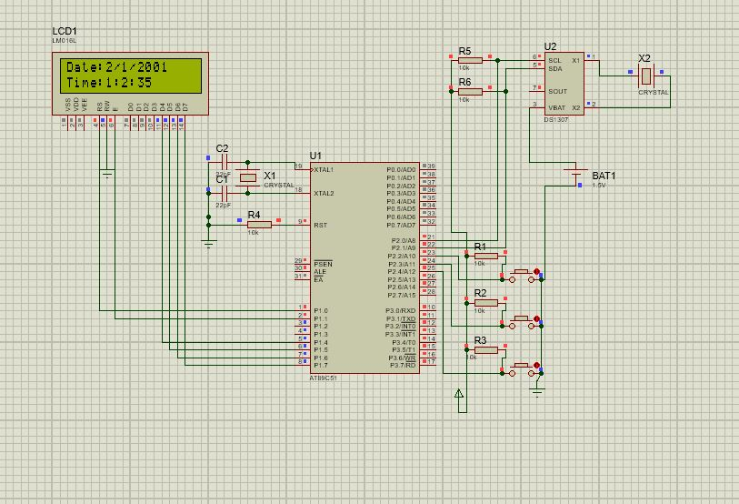

# Digital Clock using 8051 Microcontroller 🕒

This project demonstrates how to design a Digital Clock using an 8051 microcontroller.
The clock displays the time on a 7-segment display and allows for setting the time using buttons.

## Components 🛠️
- 8051 Microcontroller (e.g., AT89C51)
- 7-Segment Displays 
- RTC ds1307
- Resistors for current limiting
- Push Buttons (for setting time)
- Crystal Oscillator (for clock timing)
- Transistor (optional) for driving 7-segment displays
- Power Supply (5V DC)

